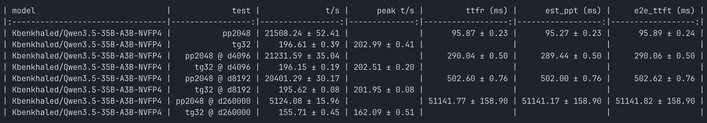

# Qwen3.5-35B-A3B-NVFP4 on RTX 5090 with vLLM

Run [Qwen3.5-35B-A3B](https://huggingface.co/Qwen/Qwen3.5-35B-A3B) (Mamba-hybrid MoE, 35B total / 3B active) on a single **NVIDIA RTX 5090** (32 GB) using [vLLM](https://github.com/vllm-project/vllm) with **NVFP4 quantization**.

## ⚡ Performance

Benchmarked on a single RTX 5090 (32 GB) with [llama-bench](https://github.com/ggml-org/llama.cpp/tree/master/tools/llama-bench) using the [Kbenkhaled/Qwen3.5-35B-A3B-NVFP4](https://huggingface.co/Kbenkhaled/Qwen3.5-35B-A3B-NVFP4) checkpoint:

| Metric | 4K Context | 8K Context | 256K Context |
|---|---|---|---|
| **Prompt processing** (pp2048) | 21,232 t/s | 20,401 t/s | 5,124 t/s |
| **Text generation** (tg32) | 196 t/s | 196 t/s | 156 t/s |
| **Time to first token** | 290 ms | 503 ms | 51,142 ms |

> **~200 tokens/sec generation speed** — fast enough for real-time interactive use.

## Features

- 256K context length with FP8 KV cache
- NVFP4 quantization via Marlin GEMM backend
- Auto-patches vLLM to correctly handle BF16 layers (Mamba attention, MoE gates, MTP)
- Uses the official `vllm/vllm-openai:nightly` Docker image — no custom builds needed

## GPU Compatibility

> **⚠️ This setup is tested and verified on NVIDIA RTX 5090 only.**

NVFP4 quantization requires Blackwell architecture FP4 tensor core instructions. Additionally, the `vllm/vllm-openai:nightly` Docker image ships with PyTorch kernels compiled for **SM 12.0**, which matches the RTX 5090 but may not work on other Blackwell GPUs with different compute capabilities (e.g. DGX Spark GB10 is SM 12.1).

## Quick Start

```bash
# Clone this repo
git clone https://github.com/Li-Lee/vllm-qwen3.5-nvfp4-5090.git
cd vllm-qwen3.5-nvfp4-5090

# Create your .env from the template
cp .env.example .env
# Edit .env with your HF token and cache path
vim .env

# Start the server
docker compose up -d

# Check logs (model loading takes ~5-10 min on first run)
docker compose logs -f
```

The OpenAI-compatible API will be available at `http://localhost:8000`.

## Configuration

All user-specific settings live in `.env` (see [`.env.example`](.env.example)):

| Variable | Description |
|---|---|
| `HF_TOKEN` | Your [Hugging Face token](https://huggingface.co/settings/tokens) (required for gated models) |
| `HF_CACHE` | Path to your local HF cache directory (e.g. `/home/user/.cache/huggingface`) |

### Key vLLM Parameters

| Parameter | Value | Notes |
|---|---|---|
| `--max-model-len` | `262144` | 256K context window |
| `--gpu-memory-utilization` | `0.85` | ~27 GB of 32 GB VRAM |
| `--max-num-seqs` | `4` | Max concurrent sequences |
| `--max-num-batched-tokens` | `4096` | Per-batch token budget |

## What the Patch Does

The Qwen3.5 Mamba-hybrid architecture has layers that must remain in BF16 even when the rest of the model is NVFP4-quantized. The included `fix_linear_attn_nvfp4_exclusion.py` patches vLLM at container startup to:

1. **Exclude BF16 layers** from NVFP4 quantization: `linear_attn` (Mamba), `shared_expert_gate`, `.mlp.gate` (MoE router), and `mtp.*` layers
2. **Handle weight size mismatches** gracefully during loading, re-materializing affected parameters as unquantized tensors

This patch is needed because vLLM's HuggingFace-to-vLLM name mapping doesn't correctly translate the checkpoint's quantization ignore list for this architecture. It applies to **any NVFP4 quantization** of the Qwen3.5 Mamba-hybrid model family, not just a specific checkpoint. Once vLLM upstream fixes the name mapping, this patch will no longer be needed.

## Benchmark

Tested on a single NVIDIA RTX 5090 (32 GB) using [llama-bench](https://github.com/ggml-org/llama.cpp/tree/master/tools/llama-bench):



## Requirements

- **NVIDIA RTX 5090** (32 GB VRAM) — see [GPU Compatibility](#gpu-compatibility)
- A recent NVIDIA driver (tested with 580.x)
- Docker with [NVIDIA Container Toolkit](https://docs.nvidia.com/datacenter/cloud-native/container-toolkit/latest/install-guide.html)
- A [Hugging Face token](https://huggingface.co/settings/tokens) with access to gated models

## License

This configuration is provided as-is. The model itself is subject to the [Qwen License](https://huggingface.co/Qwen/Qwen3.5-35B-A3B/blob/main/LICENSE).
